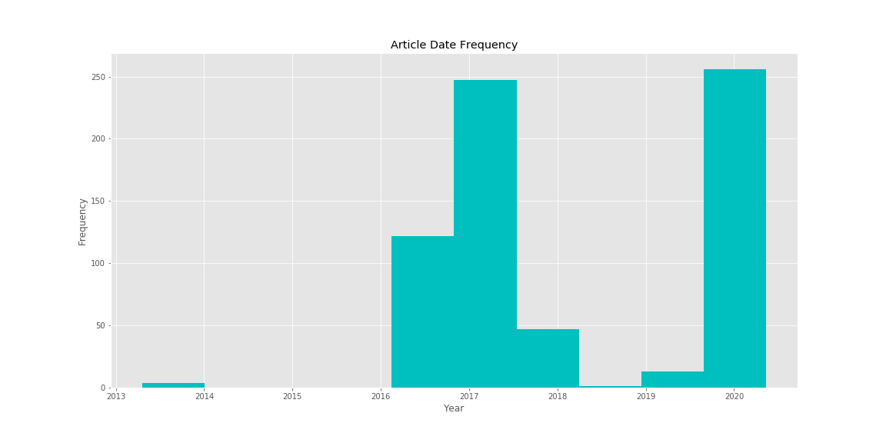
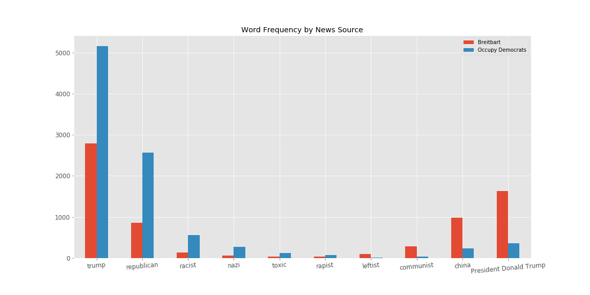
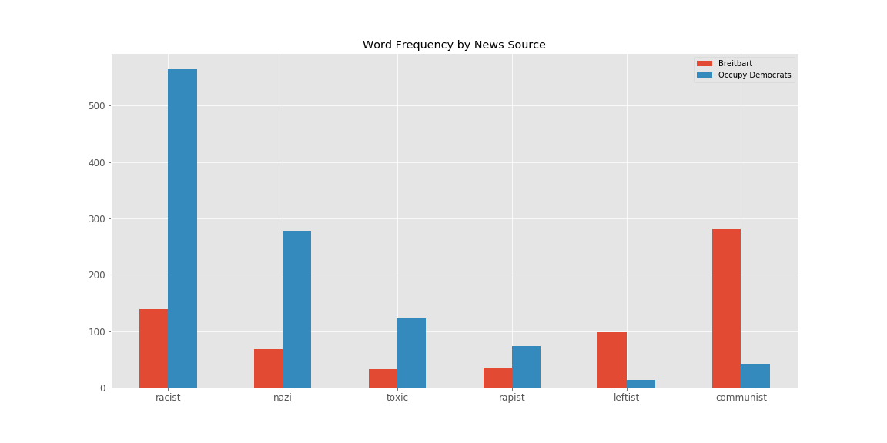

# Media Bias

## Background

In American society today, trust in the media is at an all time low. Terms like fake news and media bias have beomce commonplace in our national discourse. There are entire news sources that seem more dedicated to disseminating their own opinions rather than unbiasedly and factually reporting the news. Two such websites are Occupy Democrats, and Breitbart. Breitbart is an online news outlet with a strong conservative bias. Occupy Democrats is very similar, but it has a very strong liberal bias. Both websites often contain propaganda and report misleading info. These two websites are prefect candidates to use to understand media bias.

## Questions/Objectives

The objectives of my study are as follows:
1) Create a model that can accurately predict whether a news article is from Occupy Democrats or Breitbart.
2) Interpret the model and find what words and phrases are most common with each news source.
3) Used unsupervised learning to find the most important topic/themes for each news source and compare them.

## Tools

1) Web Scraping : Beautiful Soup, Selenium, Python 3, Docker, MongoDB.

2) Data Cleaning and Visualization: Python3, Numpy, Pandas, Matplotlib, Seaborn.

3) Data analysis and Model Building: Python3, Numpy, Pandas, Matplotlib, Sklearn, NLTK.

## Exploratory Data Analysis

I scraped about 5673 articles from each website. My total dataset contained about 11,200 articles.

The majority of articles had on average between 0 and 1000 words for both sources. However, Breitbart had a higher frequency of articles that were over 1000 words.

It is also interesting to note that Breitbart had significantly more authors publish articles. About 95 different authors published articles for Breitbart over the given period while only about 26 authors published articles for Occupy Democrats.

The author that published the most articles for Breitbart, still published less frequently than the fifth highest author for Occupy democrats. A smaller number of authors publishing content may mean more bias in any given article given that articles for both websites contain a lot of opinion pieces rather than straight factual reporting.

## Inconsistencies with Article Dates

I scraped my data from the politics section of each website. I started with the most recent articles and went back as far as I could. The time period of the articles goes back all the way to 2013.

However, it turned out that all of the Breitbart articles are from the year 2020, while the majority of Occupy Democrats articles are from 2016 and 2017.

The interpretability of my model is limited given the inconsistencies in the dates of the articles I scraped. Given that the Breitbart articles are all from very recently, the coronavirus pandemic was mentioned frequently. Words like 'pandemic' and 'coronavirus' were my most important features. I could have re-scraped the data if I had more time but I decided to go ahead and build my model and get as much insight into the news sources as I could. 

## Data Cleaning and Processing
Once I had the raw data, I used a TFIDF vectorizer to fit my article data. I used 5000 features in my model and I created a tokenizer to stem and tokenize the articles. I then removed stop words and included all the coronavirus related words in order to minimize the effect of the inconsistent dates as much as possible, and then proceeded to build my model.

## Supervised Model

I tried multiple models, but the one that resulted in the highest amount of accuracy was a Random Forest Classifier. I used 1 to 4 grams as this resulted in the highest accuracy of 95.8%. 

Some noticable features that were important in classifying the articles was the word 'muslim', which was 5 times more likely to be used on Occupy Democrats, as well as the phrase 'admit coordinate impeach Trump'.

The graph below showes some important features as well as some word that I was curious about their usage in both news sources.

Occupy Democrats was far more likely to use the word 'Trump'. In fact, 'Trump' was used over 5000 times which is on average almost once per article. The words 'republican', 'racist' and 'nazi', were also a lot more likely to be used on Occupy Democrats. 

Conversley, Breitbart was significantly more likely to refer to Donald Trump as President Donald Trump. Breitbart was also more likely to use the words 'communist', 'China' and 'leftist.

## Unsupervised Model

Outside of the most important features, I wanted to get an idea of the topics that were being discussed in both news sources. I used negative matrix factorization on both news sources seperately and found the most important topics. 

For Occupy Democrats they were as follows:
1) Trump Campaign

2) Russian Election Interference

3) Impeachment Investigation

4) Comey Election Investigation

5) Sexual Assault

6) Donald Trump's Tweets

These all make sense given that the majority of the Occupy Democrats articles were from late 2016 and 2017 when President Trump was elected.

For Breitbart, the most important topics were more ambiguous. This is likely because of the significant coverage surrounding coronavirus in recent months and the fact that I used stopwords to remove coronavirus related words in order to correct for the inconsistencies with the article dates. The topics are as follows:

1) Communism

2) Taxation

3) Presidential Elections

4) Kushner negotiations with North Korea

## Conclusion and Future Work
As I previously mentioned, the interpretability of my model was negatively affected by the fact that most of the Occupy Democrats articles are from around the 2016 elections while most of my Breitbart articles are from the past 3 months. However the models I built still give a lot of insight into the difference between these two news sources. It is clear that the type language used differs and that each website tends to focus on the same issues but in different ways.

In the future I would like to conduct this experiment again and control for the time period of the articles used. This would allow my model to pick up on the subtle biases in the news sources rather than the fact that the articles are from different time periods.

I would also like to conduct a similar experiment with a biased news source and an unbiased one and see how they differ in terms of the type of language used.

## Sources and Contact Info
https://www.breitbart.com/politics/

https://occupydemocrats.com/category/politics/

email: oakalejaiye@gmail.com