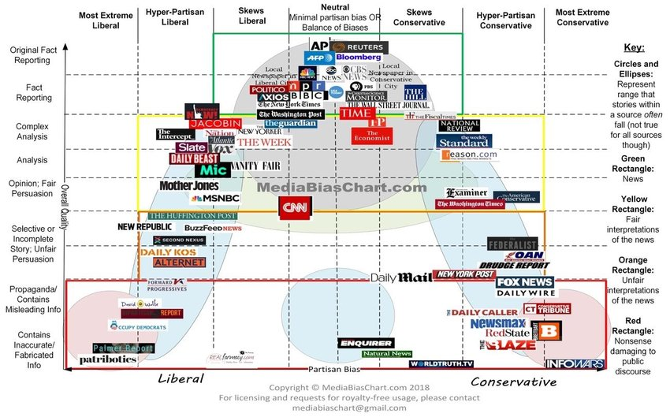
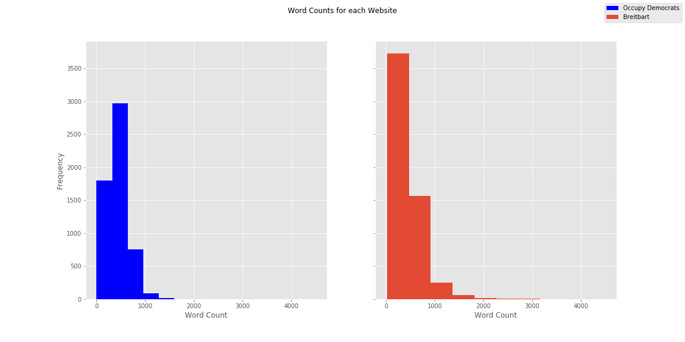
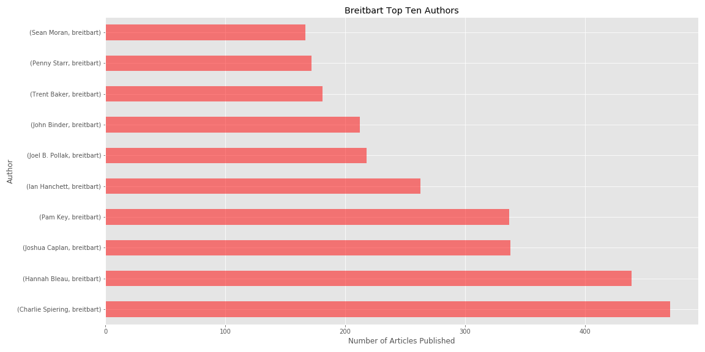
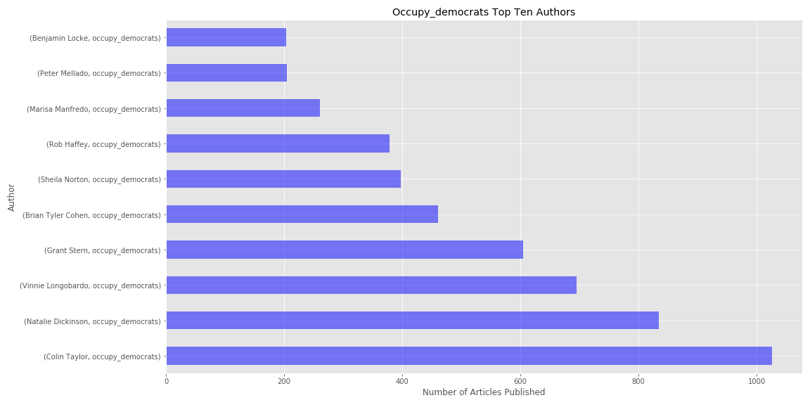
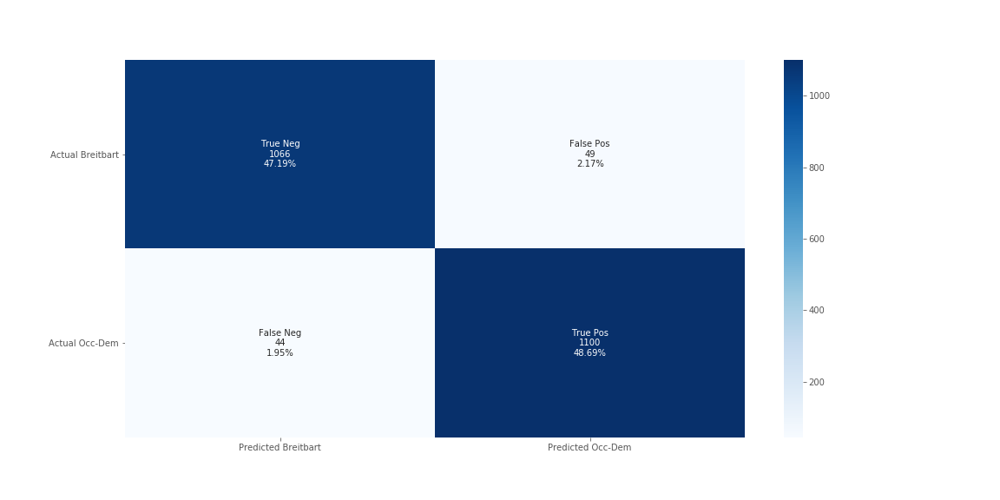

# Media Bias

## Background

>In American society today, trust in the media is significantly lower than it has been in previous years. Terms like fake news and media bias have beomce commonplace in our national discourse. There are entire news sources that seem more dedicated to disseminating their own opinions rather than unbiasedly and factually reporting the news. Two such websites are Occupy Democrats, and Breitbart. Breitbart is an online news outlet with a strong conservative bias. Occupy Democrats is very similar, but it has a very strong liberal bias. Both websites often contain propaganda and report misleading info. These two websites are prefect candidates to use to understand media bias.

## Questions/Objectives

> The objectives of my study are as follows:
1) Create a model that can accurately predict whether a news article is from Occupy Democrats or Breitbart.
2) Interpret the model and find what words and phrases are most common with each news source.
3) Used unsupervised learning to find the most important topic/themes for each news source and compare them.

## Tools

>1) Web Scraping : Beautiful Soup, Selenium, Python 3, Docker, MongoDB.

>2) Data Cleaning and Visualization: Python3, Numpy, Pandas, Matplotlib, Seaborn.

>3) Data analysis and Model Building: Python3, Numpy, Pandas, Matplotlib, Sklearn, NLTK.

## Exploratory Data Analysis

>I scraped about 5673 articles from each website. My total dataset contained about 11,200 articles.

>The majority of articles had on average between 0 and 1000 words for both sources. However, Breitbart had a higher frequency of articles that were over 1000 words.

>It is also interesting to note that Breitbart had significantly more authors publish articles. About 95 different authors published articles for Breitbart over the given period while only about 26 authors published articles for Occupy Democrats.

>The author that published the most articles for Breitbart, still published less frequently than the fifth highest author for Occupy democrats. A smaller number of authors publishing content may mean more bias in any given article given that articles for both websites contain a lot of opinion pieces rather than straight factual reporting.

## Inconsistencies with Article Dates

>The interpretability of my model is limited given the inconsistencies in the dates of the articles I scraped. Given that the Breitbart articles are all from very recently, the coronavirus pandemic was mentioned frequently. Words like 'pandemic' and 'coronavirus' were my most important features. I could have re-scraped the data if I had more time but I decided to go ahead and build my model and get as much insight into the news sources as I could. I included all the coronavirus relates words in my stop words to minimize this effect as much as possible, and then proceeded to build my model.

## Supervised Learning Model

I tried multiple models but the one that resulted in the highest amount of accuracy was a Random Forest Classifier. I used 1 to 4 grams as this resulted in the highest accuracy of 95.8%. 

